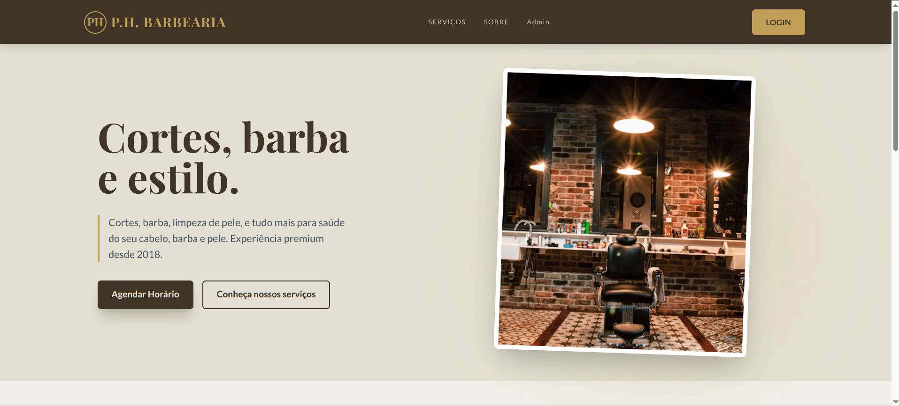
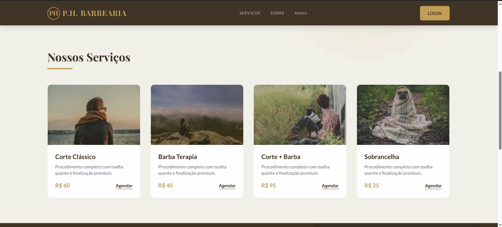
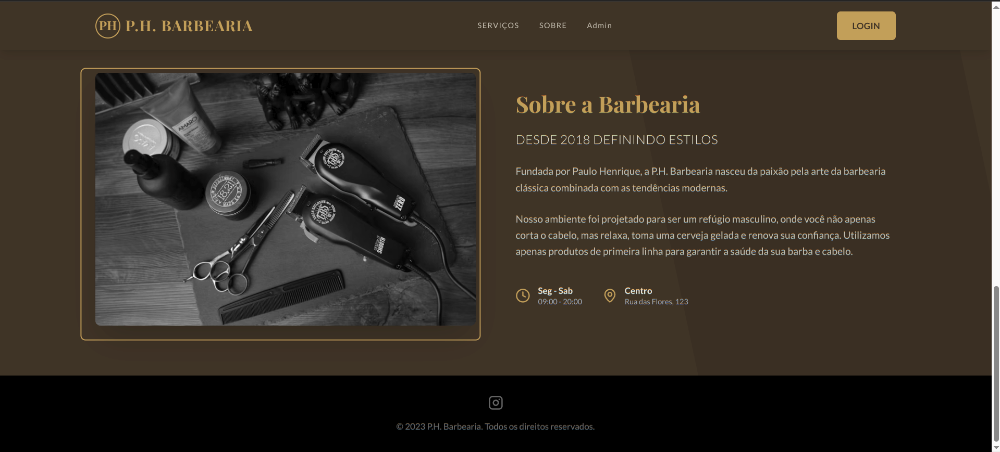
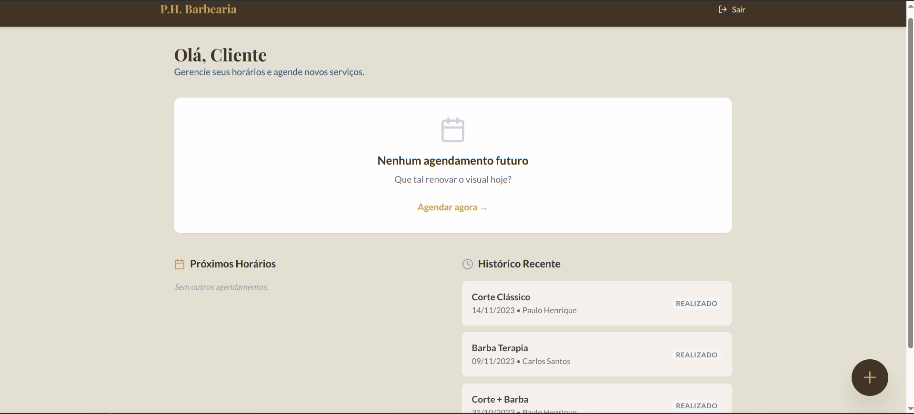
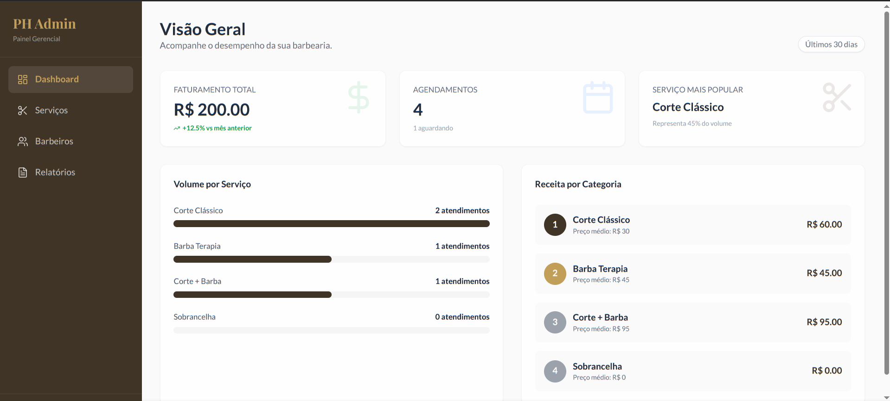

# CSI606-2026-01 - Remoto - Proposta de Trabalho Final

**Discente:** Pedro Alves de Paula

## Resumo

O projeto **Gerenciador de horários** é uma plataforma Full-Stack de gestão logística e agendamento voltada para o modelo de barbearia (atendimento a domicílio). Desenvolvido sob a filosofia de _Progressive Web App_ (PWA) e com uma abordagem de design _Mobile-First_, o sistema procura otimizar a rotina do profissional que atua na rua. As principais funcionalidades englobam um fluxo de agendamento guiado para o cliente e um painel administrativo para o barbeiro, permitindo o gerenciamento da agenda de rotas em tempo real e controle do material de trabalho.

## 1. Tema

O trabalho final tem como tema o desenvolvimento de uma aplicação web para serviços de atendimento a domicílio de um barbeiro. O foco está na solução de problemas logísticos (distribuição de horários por localização) e na gestão de materiais de trabalho.

## 2. Escopo

O projeto terá as seguintes funcionalidades:

- **Módulo de Autenticação (PWA):** Fluxo de login, cadastro e recuperação de senha com validação via Zod e React Hook Form, adaptado para acesso rápido via mobile.
- **Módulo do Cliente (App Consumer):**
  - Catálogo de serviços e preços.
  - _Wizard_ de agendamento (seleção de serviço, localização via endereço e escolha de janela de horário).
  - Painel de acompanhamento de status do atendimento.
- **Módulo do Barbeiro (App Admin):**
  - **Schedule Dashboard:** Listagem dos atendimentos do dia, permitindo iniciar rotas e alterar status de serviço.
  - **Inventory:** Controle de estoque de descartáveis (lâminas), cosméticos e toalhas.
- **Infraestrutura Back-end:** API REST em Node.js para persistência de dados, autenticação JWT e regras de negócio.

## 3. Restrições

Neste trabalho não serão considerados:

- **Pagamentos Integrados**
- **Navegação GPS Nativa**
- **Multi-profissional**

## 4. Protótipos

**Landing Page:**

**Client Page:**

**Admin Page:**

Protótipos funcionais para as páginas principais já foram codificados. Eles podem ser encontrados no diretório `/frontend` deste repositório:

- **Landing Page:** `src/modules/landingPage/`
- **Auth (Login/Register):** `src/modules/auth/`
- **Admin App Shell:** `src/layouts/admin/`
- **Schedule (Agenda):** `src/modules/admin/schedule/`

A interface utiliza **Material UI (v6)**.

## 5. Referências
