# Arquitetura e diagramas do Gerenciador de Horários

> Documentação da implementação existente em 20/07/2026. Os diagramas foram construídos a partir do código presente em `frontend/`, `backend/api-barber/src/`, `backend/api-barber/prisma/schema.prisma` e das migrations SQL. Todos os blocos Mermaid podem ser renderizados diretamente pelo GitHub, GitLab, Mermaid Live Editor ou por extensões compatíveis de Markdown.

## 1. Visão geral

O **Gerenciador de Horários — P.H. Barbearia Itinerante** é uma aplicação full-stack para atendimento de barbearia a domicílio. O produto possui uma SPA instalável como PWA, uma API REST e um banco PostgreSQL. Existem duas áreas autenticadas: a área do cliente (`USER`) e o painel do barbeiro (`ADMIN`).

| Camada | Implementação atual |
|---|---|
| Frontend | React 19, TypeScript, Vite, Material UI, React Router, Context API, React Hook Form, Zod e i18next |
| PWA/offline | Workbox, Service Worker, Background Sync e IndexedDB por meio de `idb` |
| Comunicação | REST/JSON com Axios ou `fetch`, autenticação Bearer JWT e CORS |
| Backend | NestJS 11, controllers, services, guards, DTOs, ValidationPipe e Swagger/OpenAPI |
| Persistência | Prisma ORM 7 com adapter `pg` e PostgreSQL 15 |
| Identidade | E-mail/senha com bcrypt ou Google Identity; sessão da aplicação emitida como JWT |

### 1.1 Contexto geral do sistema

**Tipo:** diagrama UML de componentes em nível de contexto.

**Resumo:** mostra as partes executáveis do sistema e os serviços externos. O navegador executa a SPA/PWA, que conversa com a API por HTTP/JSON. A API valida o login Google quando necessário e é a única camada que acessa o PostgreSQL. O IndexedDB é um armazenamento local específico do navegador e sustenta o modo offline administrativo.

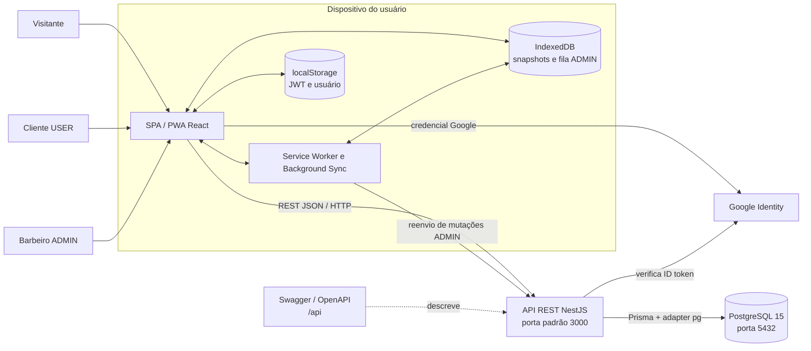

No ambiente local, o frontend é servido em `http://localhost:5173`, a URL padrão da API é `http://localhost:3000` e o `docker-compose.yml` publica o PostgreSQL em `localhost:5432`. O CORS do backend aceita atualmente apenas a origem do frontend local.

## 2. Arquitetura do frontend

### 2.1 Componentes e módulos do frontend

**Tipo:** diagrama UML de componentes/pacotes.

**Resumo:** apresenta a decomposição da aplicação React. O bootstrap monta os providers globais e o roteador. As rotas carregam os módulos de forma lazy; os módulos acessam serviços HTTP compartilhados e, no painel administrativo, também a infraestrutura offline.

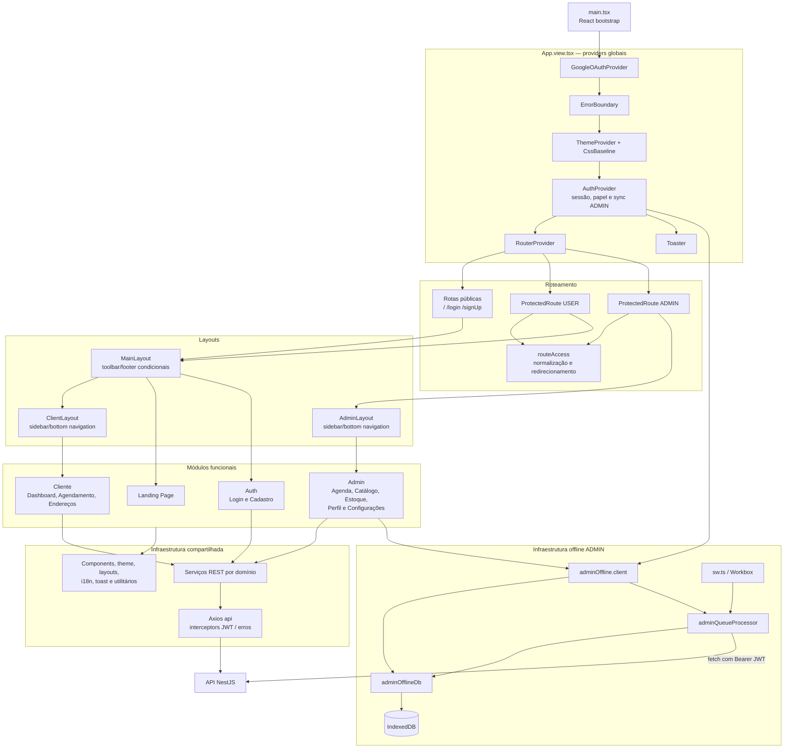

O `ProtectedRoute` faz a proteção no cliente para melhorar navegação e experiência, mas não substitui os guards do servidor. O `AuthProvider` restaura `@phbarber:user` e `@phbarber:token` do `localStorage`, enquanto o interceptor Axios injeta o token em cada requisição e trata `401`, `403` e falhas de servidor.

### 2.2 Estrutura interna de um módulo de tela

**Tipo:** diagrama UML de componentes com padrão Controller–Context–View.

**Resumo:** a maioria das funcionalidades segue o mesmo arranjo. O controller concentra estado e regras de interação, publica dados e ações em um Context, e a View consome esse contrato para renderizar componentes. Formulários usam React Hook Form com schemas Zod. Os arquivos `*.styles.tsx` isolam a apresentação Material UI.

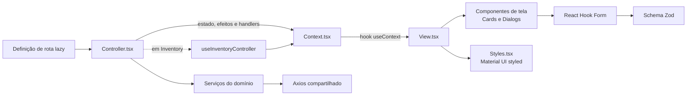

Esse padrão aparece em Landing Page, Login, Cadastro, dashboards e módulos administrativos. `Inventory` adiciona um hook de domínio próprio para separar as operações otimistas de estoque do provider que hidrata cache e monitora conectividade.

### 2.3 Mapa de navegação e controle de acesso

**Tipo:** diagrama UML de navegação/estados da interface.

**Resumo:** mostra todas as rotas implementadas, o layout que as hospeda e o papel exigido. Rotas públicas usam `MainLayout`; a área do cliente passa por `ProtectedRoute(USER)` e combina `MainLayout` com `ClientLayout`; a área administrativa passa por `ProtectedRoute(ADMIN)` e usa `AdminLayout`.

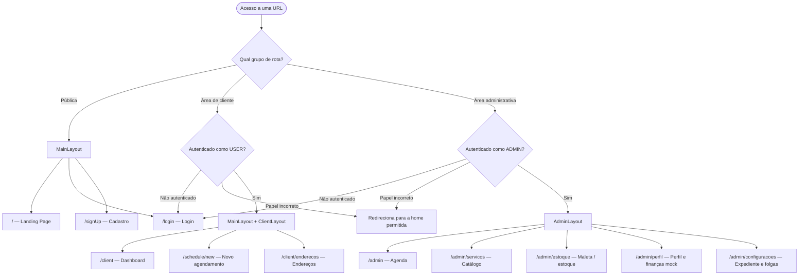

Após o login, `getRouteAfterLogin` só restaura a URL originalmente solicitada se ela pertencer ao papel autenticado. Caso contrário, o usuário é direcionado para `/client` ou `/admin`.

## 3. Arquitetura do backend

### 3.1 Camadas da API

**Tipo:** diagrama UML de componentes em camadas.

**Resumo:** descreve o processamento de uma chamada REST no NestJS. O pipeline global transforma e valida DTOs, os guards autenticam/autorizam, controllers traduzem HTTP para chamadas de aplicação, services executam regras de negócio e o Prisma persiste no PostgreSQL.

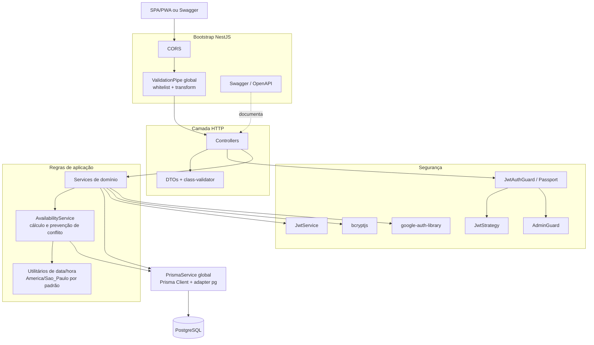

As operações críticas de criação/edição de agendamento e de quantidade de estoque usam transações com isolamento `Serializable`. O agendamento recalcula a disponibilidade dentro da transação, reduzindo a possibilidade de duas requisições reservarem a mesma faixa de horário.

### 3.2 Módulos NestJS e dependências

**Tipo:** diagrama UML de pacotes.

**Resumo:** detalha os módulos registrados no `AppModule`. Cada domínio possui controller e service próprios. `PrismaModule` é global; `AuthModule` depende de usuários e `AppointmentsModule` importa disponibilidade para reutilizar a regra de validação dos horários.

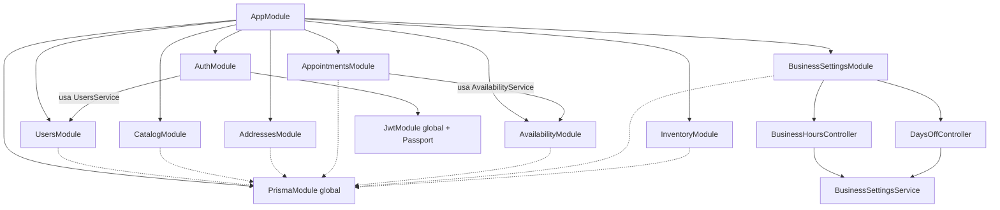

### 3.3 Responsabilidades dos domínios do backend

| Módulo | Controller(s) | Responsabilidade principal |
|---|---|---|
| `auth` | `AuthController` | Cadastro, login local, validação do ID token Google e emissão de JWT de 1 dia |
| `users` | `UsersController` | Persistência/consulta de usuários e listagem de clientes com endereços para o admin |
| `catalog` | `CatalogController` | CRUD de serviços, preço e duração; impede excluir serviço já agendado |
| `addresses` | `AddressesController` | CRUD dos endereços pertencentes ao usuário do JWT; impede excluir endereço já usado |
| `availability` | `AvailabilityController` | Calcula slots a partir de duração total, expediente, intervalo, folga e colisões |
| `appointments` | `AppointmentsController` | Criação do cliente/admin, consulta, edição, status e exclusão de agendamentos |
| `business-settings` | `BusinessHoursController`, `DaysOffController` | Expediente semanal, intervalos, folgas e feriados |
| `inventory` | `InventoryController` | CRUD e alteração transacional da quantidade do estoque |
| `prisma` | — | Conexão global compartilhada com PostgreSQL |

## 4. Usabilidade e comportamento dos usuários

### 4.1 Casos de uso por ator

**Tipo:** diagrama UML de casos de uso, representado em Mermaid como atores e elipses funcionais.

**Resumo:** separa o que pode ser feito por visitante, cliente e administrador. `USER` e `ADMIN` são papéis persistidos no usuário e verificados tanto pelo roteamento do frontend quanto pelos guards do backend.

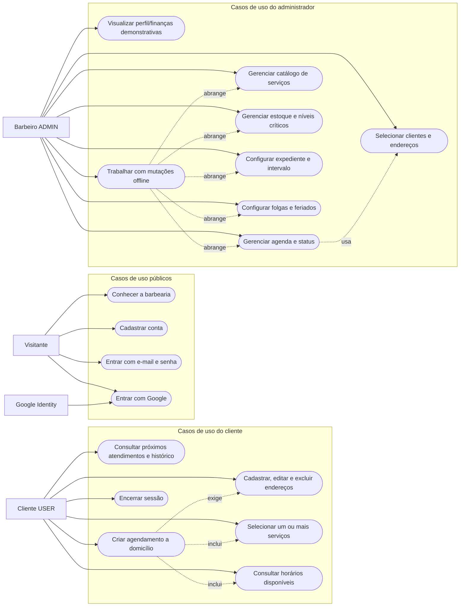

O conteúdo financeiro de `/admin/perfil` é atualmente demonstrativo: as transações estão definidas como dados mock no frontend e não possuem tabela ou endpoint no backend.

### 4.2 Jornada do cliente para agendar

**Tipo:** diagrama UML de atividades.

**Resumo:** representa o wizard implementado em `/schedule/new`. Serviços e endereços são carregados ao abrir a tela; a mudança de data ou serviços dispara uma nova consulta de disponibilidade. A confirmação só é enviada após todas as escolhas obrigatórias.

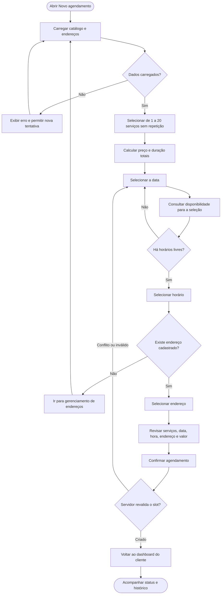

### 4.3 Ciclo de vida do agendamento

**Tipo:** diagrama UML de máquina de estados.

**Resumo:** mostra os quatro valores persistidos no enum `AppointmentStatus`. A implementação aceita que o administrador escolha qualquer valor a partir de qualquer estado. `PENDING` e `CONFIRMED` são estados ativos e bloqueiam disponibilidade; ao reativar um agendamento concluído/cancelado, o backend revalida o slot.

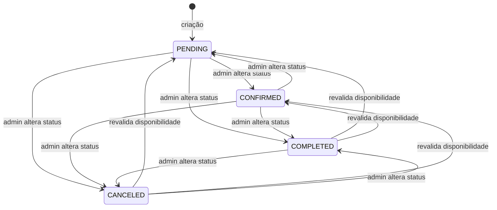

Não existe hoje uma tabela de histórico de status; somente o valor atual é mantido em `appointments.status`.

## 5. Comunicação entre cliente e servidor

### 5.1 Autenticação local e Google

**Tipo:** diagrama UML de sequência.

**Resumo:** compara os dois caminhos de autenticação. Nos dois casos, a API termina emitindo seu próprio JWT. A credencial Google é verificada no servidor, e uma conta pode ser criada ou vinculada pelo e-mail validado.

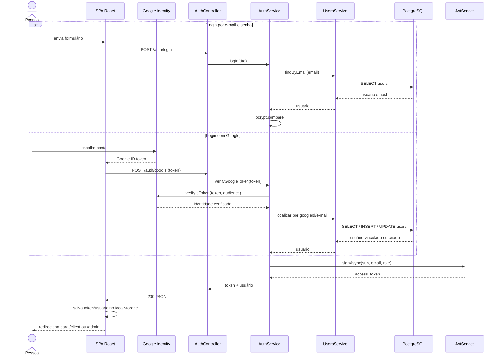

O cadastro local (`POST /auth/register`) valida os dados, rejeita e-mail repetido, aplica hash bcrypt com custo 10 e cria por padrão um usuário `USER`.

### 5.2 Consulta de disponibilidade e criação de agendamento

**Tipo:** diagrama UML de sequência.

**Resumo:** mostra que a disponibilidade exibida no frontend é apenas uma prévia. Na criação, o backend verifica novamente endereço, serviços, expediente, folgas e colisões dentro de uma transação serializável, e grava os serviços na tabela associativa.

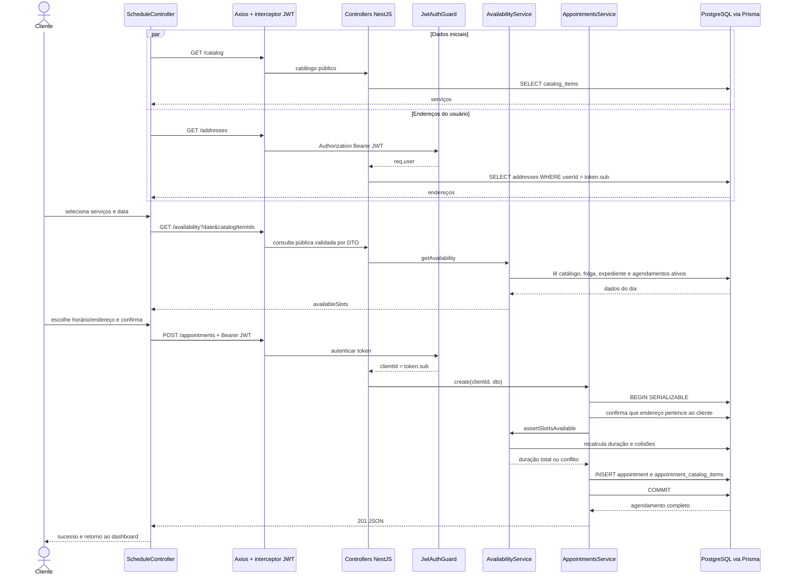

O horário é persistido como `DateTime`; as regras de negócio usam `BUSINESS_TIME_ZONE` (padrão `America/Sao_Paulo`) para interpretar o dia e a hora comercial. A duração total é copiada para o agendamento como um snapshot e é usada para detectar sobreposição futura. Os horários candidatos avançam em passos iguais à duração total da seleção, portanto a grade disponível pode mudar quando o cliente adiciona ou remove um serviço.

### 5.3 Mutação administrativa offline e sincronização

**Tipo:** diagrama UML de sequência.

**Resumo:** detalha a estratégia offline do painel administrativo. A UI é atualizada otimisticamente. Se não houver rede — ou se uma tentativa Axios falhar sem resposta HTTP — a mutação e o JWT são gravados no IndexedDB; nas criações, a UI também gera um UUID idempotente. A fila é processada em ordem pela página ou pelo Service Worker.

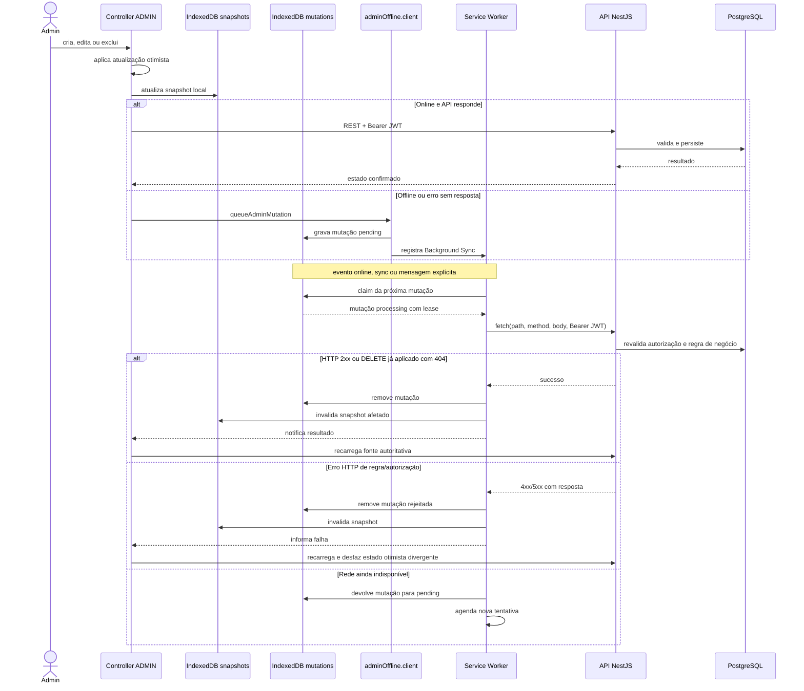

O cache offline cobre snapshots de `appointments`, `appointment-clients`, `catalog`, `inventory`, `business-hours` e `days-off`. As leituras comuns do cliente não possuem cache de API próprio; o Workbox precacheia os assets da aplicação e oferece fallback de navegação para `index.html`.

### 5.4 Mapa da API REST e permissões

**Tipo:** diagrama de comunicação por interfaces, complementado por matriz de endpoints.

**Resumo:** agrupa os recursos HTTP acessados pelo frontend e indica onde são aplicados JWT e papel administrativo.

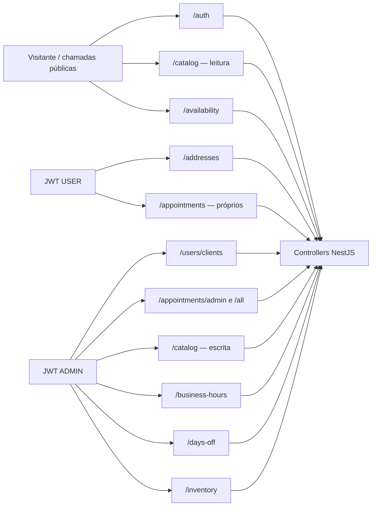

| Recurso | Operações implementadas | Acesso efetivo |
|---|---|---|
| `/` | `GET` de saúde/mensagem da API | Público |
| `/auth/register` | `POST` | Público |
| `/auth/login` | `POST` | Público |
| `/auth/google` | `POST` | Público, com ID token Google |
| `/catalog`, `/catalog/:id` | `GET` | Público |
| `/catalog`, `/catalog/:id` | `POST`, `PATCH`, `DELETE` | JWT + `ADMIN` |
| `/availability` | `GET` com `date` e `catalogItemIds` | Público |
| `/addresses`, `/addresses/:id` | `POST`, `GET`, `PATCH`, `DELETE` | JWT; operações limitadas ao `userId` do token |
| `/appointments` | `POST`, `GET` | JWT; cria/lista para o `sub` do token |
| `/appointments/admin` | `POST` | JWT + `ADMIN` |
| `/appointments/all`, `/appointments/:id` | `GET` | JWT + `ADMIN` |
| `/appointments/:id` | `PUT`, `DELETE` | JWT + `ADMIN` |
| `/appointments/:id/status` | `PATCH` | JWT + `ADMIN` |
| `/users/clients`, `/users/admin-dashboard` | `GET` | JWT + `ADMIN` |
| `/business-hours`, `/business-hours/:id` | `GET`, `POST`, `PUT`, `DELETE` | JWT + `ADMIN` |
| `/days-off`, `/days-off/:id` | `GET`, `POST`, `DELETE` | JWT + `ADMIN` |
| `/inventory`, `/inventory/:id`, `/inventory/:id/quantity` | `GET`, `POST`, `PATCH`, `DELETE` | JWT + `ADMIN` |
| `/api` | Interface Swagger/OpenAPI | Sem guard global na implementação atual |

## 6. Modelagem atual do PostgreSQL

### 6.1 Diagrama entidade-relacionamento físico

**Tipo:** diagrama ER (entidade-relacionamento) da modelagem física atual.

**Resumo:** contém todas as oito tabelas definidas pelo Prisma e suas chaves. O relacionamento entre agendamentos e serviços é muitos-para-muitos por `appointment_catalog_items`. Expediente, folgas e inventário são tabelas independentes, consultadas por regra de negócio e sem chave estrangeira para outras entidades.

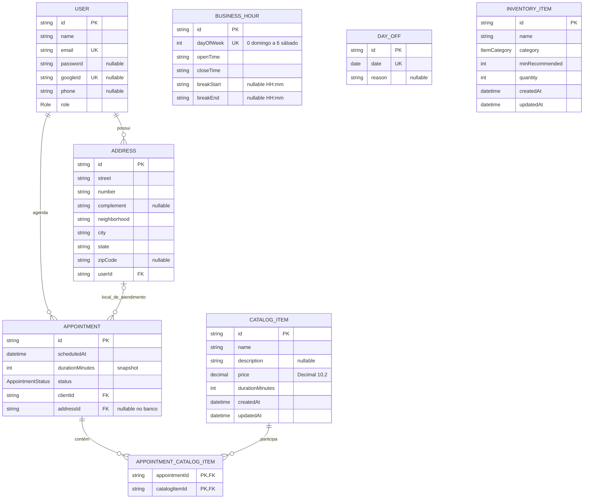

Embora `addressId` seja anulável no schema físico por compatibilidade, os DTOs atuais de criação e edição exigem um endereço, e o service confirma que ele pertence ao cliente selecionado.

### 6.2 Modelo lógico por domínio e influência na disponibilidade

**Tipo:** diagrama UML de classes conceituais/modelo lógico.

**Resumo:** evidencia relações que não são chaves estrangeiras. `BusinessHour` e `DayOff` influenciam o cálculo por dia; os agendamentos ativos ocupam intervalos; a soma das durações dos serviços define o tamanho de cada slot. `InventoryItem` permanece isolado do agendamento.

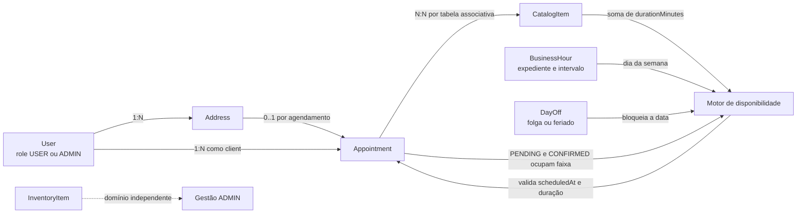

### 6.3 Enums persistidos

**Tipo:** diagrama UML de enumerações.

**Resumo:** lista os valores fechados usados pelo PostgreSQL/Prisma para autorização, estado dos agendamentos e classificação do estoque.

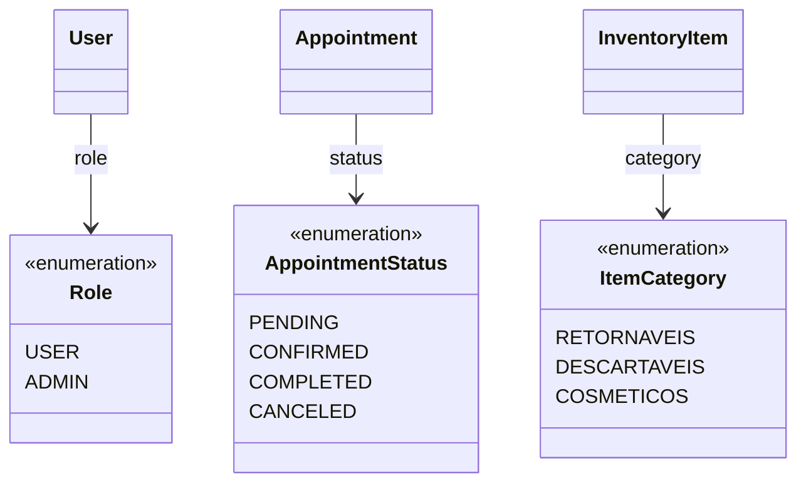

### 6.4 Chaves, índices e regras de integridade

| Tabela | Integridade relevante |
|---|---|
| `users` | PK UUID; `email` e `googleId` únicos; `role` padrão `USER`; senha é opcional para contas Google |
| `addresses` | FK `userId → users.id` com `ON DELETE CASCADE` |
| `catalog_items` | Preço `DECIMAL(10,2)`; timestamps automáticos pelo Prisma |
| `appointments` | FKs para cliente e endereço com restrição de exclusão; índice composto em `(scheduledAt, status)`; `status` padrão `PENDING` |
| `appointment_catalog_items` | PK composta `(appointmentId, catalogItemId)`; cascade ao excluir agendamento; restrict ao excluir serviço; índice por `catalogItemId` |
| `business_hours` | Um registro por `dayOfWeek` por meio de índice único |
| `days_off` | Uma folga por `date` por meio de índice único |
| `inventory_items` | Índice em `(category, name)` e checks SQL que impedem `minRecommended` e `quantity` negativos |

Regras adicionais vivem na aplicação: não repetir serviços em um agendamento, limitar a seleção a 20 itens, impedir colisão de intervalos, exigir horário futuro, validar intervalo dentro do expediente, impedir quantidade negativa e usar UUID enviado pelo cliente nas criações administrativas offline para obter idempotência por `upsert`/reconhecimento de registro já existente.

## 7. Fluxo de dados resumido por funcionalidade

| Funcionalidade | Frontend | Backend | Tabelas principais |
|---|---|---|---|
| Cadastro/login | Auth Controllers, AuthContext, `auth.service.ts` | AuthService, UsersService, JWT/Google/bcrypt | `users` |
| Endereços | Client Addresses Controller e service | AddressesService | `addresses`, `users` |
| Catálogo | Client scheduling e Admin Catalog | CatalogService | `catalog_items`, `appointment_catalog_items` |
| Disponibilidade | Schedule do cliente | AvailabilityService | `catalog_items`, `business_hours`, `days_off`, `appointments` |
| Agendamentos | Dashboard/Schedule do cliente e Agenda admin | AppointmentsService + AvailabilityService | `appointments`, `appointment_catalog_items`, `users`, `addresses`, `catalog_items` |
| Configuração do negócio | BusinessSettings admin | BusinessSettingsService | `business_hours`, `days_off` |
| Estoque | Inventory Context/Controller/hook | InventoryService | `inventory_items` |
| Offline administrativo | snapshots, fila, Service Worker | Mesmos endpoints protegidos; idempotência nos POSTs suportados | IndexedDB local e tabelas do domínio sincronizado |

## 8. Observações sobre o estado atual

- A aplicação é **single-professional**: não existe entidade de barbeiro/profissional associada a agenda, catálogo ou expediente.
- Pagamentos, navegação GPS e recuperação de senha não estão implementados no código atual.
- A Landing Page exibe um catálogo estático demonstrativo; o catálogo persistido é consumido no wizard do cliente e no painel admin.
- A proteção existe em duas camadas: redirecionamento por papel no React Router e autorização efetiva com JWT/`AdminGuard` na API.
- O catálogo e o endereço usados por um agendamento não podem ser excluídos enquanto estiverem associados. A duração é preservada no próprio agendamento; nome/preço do serviço e campos do endereço continuam sendo lidos das entidades relacionadas atuais.
- A documentação Swagger é montada em `/api`; os DTOs e o `ValidationPipe` removem propriedades não declaradas e rejeitam campos extras.
- O PWA oferece shell instalável e suporte offline administrativo, mas o backend e o PostgreSQL continuam sendo a fonte autoritativa dos dados sincronizados.
